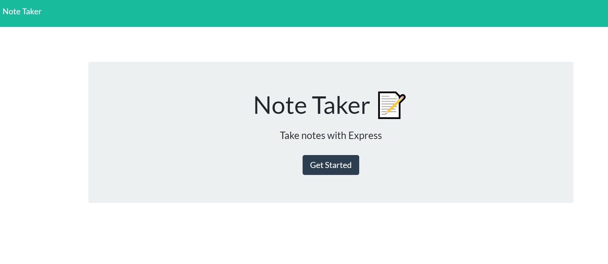
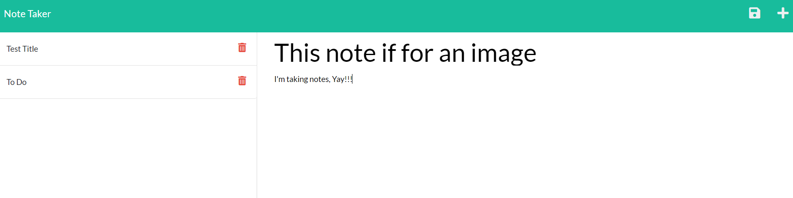

# Express Note Taker

## Project Description
* This application is built with an Express.js back end and will allow a user to save, retrieve and delete the users notes from the data in a JSON file.

## Installations
* Express
* uuid
* fs
* Path
* Inquire

## Usage Information
* This application allowes a user to create and save notes on a JSON file running off a Express.js back end. If that user is done with there notes they are able to delete those notes and create new ones whenever they need.

## Contributor Guidelines
* Contribution rules are under the Code of Conduct section

## Code of Conduct
* [Contributor Code of Conduct](https://www.contributor-covenant.org/version/2/0/code_of_conduct/code_of_conduct.md)

## Test Instructions
* There are no test instructions for this application.

## Questions
* For additional help or questions about collaboration, please reach out to jpodell21@gmail.com
* Follow me on Github at [JamesO1231](http://github.com/JamesO1231)

## Deployed URL Link
* [URL Link](https://gentle-brushlands-60472.herokuapp.com/)

## Deployment Image

